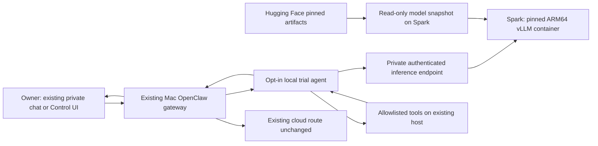

# PRD: PNY DGX Spark local AI with Hugging Face and OpenClaw

**Version:** 1.0 — research and independent review complete; deployment not started  
**Research date:** September 9, 2026, America/Chicago  
**Owner:** Project owner  
**Decision:** proceed to a bounded hardware-validation pilot, not an unconditional purchase or production migration.

## 1. Executive recommendation

Use the PNY DGX Spark as a **dedicated inference appliance**, while keeping the existing Mac OpenClaw gateway, channels, files, secrets, and working automations in place. Download a pinned Hugging Face checkpoint onto the Spark and serve it through a local OpenAI-compatible API. Add one opt-in OpenClaw trial agent; do not replace the main agent until measured results justify it.

**First candidate:** `nvidia/Qwen3.6-35B-A3B-NVFP4` using the Spark-specific vLLM recipe. NVIDIA's current OpenClaw guide explicitly recommends this combination. **Second candidate:** NVIDIA Nemotron 3.5 Lightning 30B-A3B NVFP4. Select the winner by completed user tasks, latency, tool correctness, and operating burden—not parameter count. [NVIDIA agent-ready guidance](https://build.nvidia.com/spark/openclaw/agent-ready-models)

llama.cpp is the preferred fallback for an explicitly supported GGUF checkpoint if the vLLM recipe is unreliable or too complicated. TensorRT-LLM is a later optimization, not another prerequisite for the pilot.

**Important:** Hugging Face is the artifact source here, not a hosted inference provider. The OpenClaw `huggingface` provider points to a remote inference router. For this project use the local serving provider, with model files downloaded from Hugging Face. The distinction is verified in the installed OpenClaw 2026.9.3 documentation (`providers/huggingface.md`, `providers/vllm.md`).

This PRD authorizes nothing to be installed or purchased. No system/model/channel changes, downloads of weights, account access, or hardware benchmarks were performed for this research.

## 2. Problem, users, goals and scope

The owner wants a dependable local model for coding, research, document work and OpenClaw agent tasks, with less dependence on hosted-model allowance. Current experience includes confusing model selection, long-running interruptions, and component tests that were presented as complete integrations. The new system must make actual route, progress, failure and delivery evidence visible.

### Goals

1. Run useful model inference on one Spark without paid inference-provider calls for local-only tasks.
2. Complete real OpenClaw tool loops and return results through the existing interface.
3. Preserve the current working gateway and dedicated bot routing.
4. Establish measurable quality, latency, context and reliability limits before promotion.
5. Make model revisions, runtime versions, endpoint identity and rollback reproducible.
6. Keep private inference local when explicitly selected, with no silent cloud fallback.

### Non-goals for MVP

- Wholesale migration of Mac services or existing bot pollers onto Spark.
- Fine-tuning, training a frontier model, multi-Spark clustering, or simultaneous large-model council serving.
- Guaranteeing parity with hosted frontier models or claiming hardware alone fixes integration defects.
- Modifying trading systems, execution permissions, or other unrelated application rules.
- An unrestricted agent with production secrets and arbitrary filesystem/network access.

### Assumptions, not established facts

One PNY Spark is intended; ownership/purchase status, exact seller SKU, final price, network port speeds at the Mac/switch, and return terms are unknown. Plan assumes one primary user, one active local generation initially, and a stable existing gateway. Hardware access is not available in this research turn.

## 3. Hardware assessment

| Property | Verified baseline | Design consequence |
|---|---|---|
| PNY SKU | NVDGXSPARK-PB | Verify seller SKU, regional warranty and delivered configuration before purchase |
| Compute | NVIDIA GB10 Grace Blackwell; 20-core Arm CPU | Linux ARM64 runtime/container and GB10-compatible kernels required; x86 recipes are not interchangeable |
| Memory | 128 GB unified LPDDR5x | Shared by CPU, GPU, OS and caches; not 128 GB dedicated VRAM plus system RAM |
| Bandwidth | 273 GB/s | Capacity does not guarantee interactive decode speed |
| Storage | PNY datasheet lists 4 TB NVMe | Budget downloaded weights, images, cache duplication and rollback snapshots |
| Networking | Ethernet plus ConnectX high-speed interconnect | Ordinary private client-server traffic does not need a two-Spark interconnect |

Hardware source: [PNY datasheet](https://www.pny.com/File%20Library/Company/Support/Product%20Brochures/nvidia-dgx-spark/nvidia-dgx-spark-workstation-datasheet.pdf). Architecture/runtime considerations: [NVIDIA porting guide](https://docs.nvidia.com/dgx/dgx-spark-porting-guide/overview.html).

The advertised up-to-200B model capacity and theoretical sparse-FP4 compute figure are not single-user throughput measurements. Weight-only arithmetic illustrates the problem: 35B at 4 bits is 17.5 GB; 70B is 35 GB; 200B is 100 GB. Those are decimal lower-bound calculations, not checkpoint sizes or memory-residency forecasts. Mixed-precision layers, scale metadata, KV/state cache, activations and runtime overhead add memory. MoE active-parameter counts do not eliminate residency of the other experts. [NVIDIA specifications](https://www.nvidia.com/en-gb/products/workstations/dgx-spark/)

**Capacity policy:** one resident generation model first, one active request, bounded queue. Start the agent profile at 32K context and reserve output space within it. Test 64K next; 128K/262K/1M advertised windows are optional stress profiles, not guaranteed usable contexts. Smaller 8K fixtures are diagnostic benchmarks, not a promise that the full OpenClaw bootstrap fits.

NVIDIA documents shared-memory reporting caveats: `nvidia-smi` may show memory usage as unsupported. Use OS available-memory measurements, runtime allocations and observed OOM/swap behavior together. Do not “fix” this by assuming dedicated GPU memory. [Known issues](https://docs.nvidia.com/dgx/dgx-spark/known-issues.html)

## 4. Deployment architecture

**Recommended split:** inference runs on Spark; orchestration and tools stay where they currently work. A local model endpoint does not automatically move tool execution to the Spark. The inference container needs neither the Mac home directory nor production credentials mounted into it.

**Transport:** preferably Spark loopback server through an authenticated application-level SSH tunnel terminating on Mac loopback. A private LAN TLS endpoint with enforced authentication and restricted clients is an alternative. Endpoint topology must be recorded; do not expose an unauthenticated model service to the Internet. No OS-level routing/DNS/VPN change is implied by this design.

**Privacy modes:**

- `local-only`: no cloud model fallback; outage returns a clear unavailable result.
- `cloud-explicit`: owner deliberately chooses an existing hosted model for a task.
- Web search, Telegram and external tools remain external even with local inference. “Local model” does not mean the entire workflow is air-gapped.

**Recovery:** Spark shutdown must not take down ordinary Mac-agent replies, existing scheduled work or dedicated bots. Rollback removes/disables only the trial route and stops the inference service if needed; preserve normal gateway configuration. No migration of existing credentials, bindings or polling ownership is required for this architecture.

## 5. Runtime and model selection

| Runtime | Strength | Constraint | Decision |
|---|---|---|---|
| vLLM | Documented Spark/OpenClaw agent recipe; batching, structured API | ARM64/GB10 image, quantization backend, parser and template must match | First implementation route |
| llama.cpp CUDA | Flexible GGUF serving; comparatively direct local setup | Exact architecture/tool template and quantization support still require testing | Fallback experiment if vLLM fails acceptance |
| TensorRT-LLM | NVIDIA optimized serving paths | Model/backend-specific tuning and release compatibility | Later, only for measured benefit |
| Ollama / LM Studio | Convenient model management/UI | Adds another management layer; support and parser behavior must be checked for chosen Spark model | Optional, not required |
| HF hosted Inference Providers | Hosted model catalog | Remote calls and provider billing | Not the requested local deployment |

Sources: [NVIDIA vLLM](https://build.nvidia.com/spark/vllm), [llama.cpp on Spark](https://build.nvidia.com/spark/llama-cpp/instructions), [TensorRT-LLM on Spark](https://build.nvidia.com/spark/trt-llm/instructions).

### Model evaluation queue

| Priority / role | Exact candidate | Rationale / caveat |
|---|---|---|
| 1: general OpenClaw agent | `nvidia/Qwen3.6-35B-A3B-NVFP4` | Official Spark/OpenClaw recommendation; Apache-2.0, 35B total / 3B active. Card lists up to 262K context. Test smaller deployment window first. |
| 2: alternate general/reasoning | `nvidia/NVIDIA-Nemotron-3.5-Lightning-30B-A3B-NVFP4` | Explicit single-Spark recipe; OpenMDW-1.1 license, not Apache. Spark recipe uses NVFP4 storage with Marlin W4A16 computation; do not call it native FP4 compute. |
| 3: specialist coding | `Qwen/Qwen3-Coder-Next-FP8` | 80B total / 3B active, Apache-2.0. Rough 80 GB weight arithmetic leaves materially less runtime/context headroom. Optional challenger, not default. |

Primary cards: [Qwen NVFP4](https://huggingface.co/nvidia/Qwen3.6-35B-A3B-NVFP4), [Nemotron Lightning](https://huggingface.co/nvidia/NVIDIA-Nemotron-3.5-Lightning-30B-A3B-NVFP4), [Qwen Coder Next](https://huggingface.co/Qwen/Qwen3-Coder-Next), [Coder FP8](https://huggingface.co/Qwen/Qwen3-Coder-Next-FP8).

These are candidates, not on-device performance results. Vision is a separate later acceptance profile even if the model card supports it. No guarantee is made that any candidate matches the current hosted model's reasoning or coding quality.

### Recipe discipline

NVIDIA's Qwen Spark card supplies a model-specific Marlin/FlashInfer/FP8-cache recipe, `qwen3` reasoning parsing, `qwen3_xml` tool parsing and speculative decoding. Its sample includes `--trust-remote-code` and a broad listen address. Do not copy the command unreviewed. Pin and inspect required remote code, restrict access, and benchmark speculative features separately. A different checkpoint/version may require a different parser. [Qwen Spark recipe](https://huggingface.co/nvidia/Qwen3.6-35B-A3B-NVFP4)

Resolve a versioned ARM64 image with working GB10 support; pin its immutable digest. Do not deploy floating `latest`/`nightly` references or generic CUDA wheels just because they install. Conservative memory utilization must follow the selected recipe—not one universal fraction for every model. First establish the published supported combination; simplify/tune one setting at a time with retained results.

## 6. Hugging Face artifact management

For each approved model, retain a manifest with: repository ID; full revision commit; license; download size; file hashes; quantization; architecture; tokenizer/chat-template hash; runtime image digest; exact parser flags; validated context/concurrency; benchmark results; installation date; rollback version.

Use the official Hub download tooling with an immutable revision and a dedicated cache/snapshot directory. Public ungated models may not require authentication. Gated/private models require owner acceptance and a scoped credential through protected entry; never put tokens in the PRD, launch arguments or logs. Validate available storage before downloading. [HF download guide](https://huggingface.co/docs/huggingface_hub/guides/download)

After artifacts are cached, verify inference with model-download egress unavailable. Keep the serving process from silently downloading a new revision. Prefer reviewed safetensors/GGUF artifacts; audit code required by `trust_remote_code`. Model files are not interchangeable across GGUF, FP8 and NVFP4 runtimes merely because they represent the same family.

## 7. OpenClaw integration requirements

Installed documentation was checked read-only; OpenClaw is 2026.9.3 in this session. Revalidate the deployed schema when implementation begins.

- Use an explicit `models.providers.vllm` entry with `api: "openai-completions"`, a verified `/v1` endpoint and exact served model ID. Do not select the HF hosted router.
- Match advertised context/output limits to actual server allocation. Reserve prompt + tool schemas + retrieved text + history + output; do not paste this entire existing long session into a 32K trial.
- Set a provider-specific timeout based on observed prefill; a larger timeout does not make an overloaded model faster.
- Test structured tool calls, call IDs, argument schema, tool results, streaming, stop reasons, usage and final-versus-reasoning separation. Text that resembles JSON is not proof of execution.
- Do not globally force `tool_choice: required`; routine non-tool replies must remain possible. Use the exact model template/parser instead of a text-to-execution shim.
- New isolated trial agent/session only; existing default model, cron and channel ownership unchanged until promotion review.
- Stage one read-only nonce tool and isolated fixture directory before shell/file-write permissions. Preserve all host-owned tool permissions and secret handling.
- Cost fields may be zero for local token billing, but operational reports must include hardware/energy separately.

Reference: [OpenClaw vLLM integration](https://docs.openclaw.ai/providers/vllm). Exact implementation config is a later validated artifact, not an untested paste-in default replacement.

## 8. Functional requirements

| ID | Requirement | Proof artifact |
|---|---|---|
| FR-01 | Local model is discoverable under explicit stable ID | Model list plus server manifest |
| FR-02 | Local-only request never silently invokes cloud inference | Correlated route/server events and egress check |
| FR-03 | Agent completes an actual read-only tool roundtrip | Tool nonce and matching final answer |
| FR-04 | Real reply reaches the originating existing private interface | Channel message receipt and owner observation |
| FR-05 | Errors distinguish model offline, timeout, parser error and context overflow | Injected-failure logs and visible error |
| FR-06 | Model change is explicit and reversible | Route before/after plus rollback evidence |
| FR-07 | Queue is bounded; one active local generation initially | Concurrent-request and cancellation trace |
| FR-08 | A cached local-only task runs without hosted model access | Offline-inference proof; external tools disabled for this case |
| FR-09 | Health reports observed readiness, last success, queue and loaded model | Dashboard/log sample; not merely process-up status |
| FR-10 | Deployment survives approved service recovery and preserves baseline route | Recovery run and unrelated baseline reply |

## 9. Acceptance and benchmark plan

**These thresholds are proposed product acceptance criteria—not published performance claims. Freeze the suite before evaluating candidates.** If the hardware misses them, reduce the use-case scope or reject it as a main-agent replacement; do not quietly lower targets and call that success.

### Workload matrix

- 50 curated tasks: 15 code tasks in throwaway repositories; 10 supplied-document research/synthesis; 10 structured extraction; 10 multi-step tool tasks; 5 memory/context tasks. Include explicit rubrics and expected artifacts.
- At least 100 structured calls, including two sequential tools, tool errors, cancellation, malformed output and no-tool answers.
- Test 2K/8K benchmark prompts plus 32K and 64K contexts with actual OpenClaw scaffolding. 128K is optional, reported separately. Output budget fixed per task; log hidden reasoning separately where available.
- Concurrency 1 and 2; queue behavior at 4 requests. Cold start and warm-cache results separate. Record model/container/parser identity for every run.
- Compare with the owner's approved hosted baseline on identical tasks and tool permissions. Do not assume a model switch is authorized or spend is free; cloud comparison can be deferred until authorized budget is available.

### Proposed launch gates

| Category | Pass criterion |
|---|---|
| Correctness | At least 90% of the 50 task rubrics passed; no false claims of tool completion or delivery |
| Tool protocol | At least 99/100 schema-valid calls; all invalid calls rejected without execution |
| Permission handling | Zero unauthorized operations in the scripted adversarial suite; not a claim of general immunity |
| Basic latency | Warm p95 first visible answer token or usable tool call ≤10s on fixed 2K prompts |
| Tool-task latency | Warm p95 one-tool task ≤45s excluding external service delay, which is reported separately |
| Streaming | Correct completion and cancellation; no abandoned generation continuing indefinitely |
| Context | No OOM or silent truncation at the selected production window; overflow explicitly rejected/compacted |
| Reliability | 24h mixed-workload soak with no unexplained restart/OOM; record utilization and swap |
| Route isolation | Spark outage leaves normal Mac/cloud route and dedicated channels functioning |
| Rollback | Restore trial route to known baseline within five minutes, without an unnecessary gateway restart |

### Mandatory real end-to-end demonstration

An authorized private-channel message must reach the trial agent, use the local model, invoke a read-only tool that generates an unpredictable nonce, incorporate that nonce correctly, and actually deliver its answer to that same channel. Retain sanitized inbound/outbound IDs, trial session ID, inference request trace, tool-call/result identity and server model manifest. Repeat for a tool error and Spark outage. Verify a normal non-trial message afterward still uses the original route.

This is not replaced by `/v1/models`, a “hello” completion, simulated callbacks, a rendered report, or a test count. Before owner-approved real-channel testing, label results component-only. Do not use transactional tasks as the demonstration.

## 10. Operations, observability and rollback

Expose statuses: provisioning, loading, ready, busy, degraded, unavailable. Include loaded model/revision, context cap, queue depth, TTFT, task latency, available memory, OOM/restart count, last successful real tool loop and last verified reply. Unknown must remain unknown.

Use sanitized correlated logs, not raw prompts by default. Record aggregate usage and wall-power measurements. Limit retention; keep credentials and production account data out of inference logs. Run the inference service with only the needed model directory and no Docker socket or home-directory mount.

Updates go to a candidate image/model manifest, run the same acceptance suite, and promote atomically after review. Keep one known-good image/manifest. Drain in-flight requests before switching models; uncertain tool results must not be replayed blindly. Avoid autoupdating runtime, model and gateway simultaneously.

## 11. Cost, purchase decision and alternatives

**No current delivered PNY price or warranty quote was established.** Product pages intermittently returned HTTP 403; a seller quote is required. Do not substitute a different manufacturer's unit or historical launch price. Obtain exact SKU, tax/shipping, warranty region, return window/restocking terms, storage and included power/network accessories. [PNY product](https://www.pny.com/dgx-spark?iscommercial=true)

36-month cost = delivered hardware + accessories + measured electricity + maintenance labor + retained cloud spend − residual value.

Electricity = measured average watts / 1000 × operating hours × local tariff. Illustrative only: 100W average, 24h/day, 30 days at $0.15/kWh = $10.80/month; 200W = $21.60. These are arithmetic scenarios, not Spark measurements. A PSU rating is not average wall consumption.

Quota relief is not necessarily cash savings: if the existing subscription remains, avoided marginal spend can be zero. Break-even exists only when genuinely displaced monthly spend exceeds incremental operating cost. The purchase may instead be justified by local privacy, availability and development value.

| Alternative | When preferable | Tradeoff |
|---|---|---|
| Existing Mac, smaller local model | Validate OpenClaw local workflow before buying | Does not predict Spark CUDA performance |
| Spark | Large unified-memory experiments and NVIDIA stack are useful | ARM/kernel maturity, moderate bandwidth, engineering ownership |
| Discrete NVIDIA GPU workstation | Target models fit dedicated VRAM and responsiveness is priority | Larger models may require multiple GPUs; compare actual quotes/benchmarks |
| Retain hosted models | Low volume or frontier quality dominates | Allowance/provider dependence and remote inference |

**Buy/no-buy rule:** seek a seller demo or return-window pilot using the selected workload. If already owned, proceed to isolated pilot. Do not purchase solely because “200B fits” or because current orchestration mistakes are frustrating.

## 12. Milestones and estimated effort

Engineering estimates assume working hardware, ordinary network access and a compatible published recipe; download/shipping and owner interaction excluded.

1. **Preflight and procurement decision — 1–2h:** confirm SKU/ownership, target workloads, connectivity, quote/return terms and OS/runtime versions. No production changes.
2. **Single-model serving — 3–6h:** pinned model/image, direct inference, memory/latency measurements, authenticated private endpoint, offline cached inference test.
3. **OpenClaw isolated integration — 4–8h:** trial provider/agent, parser/template, tool loop, actual authorized private-channel delivery, failure and rollback tests.
4. **Candidate evaluation — 4–8h active work plus 24h soak:** compare Qwen and Nemotron on frozen tasks, select production context/concurrency, document failures.
5. **Opt-in promotion — 1–3h:** owner reviews measured report; route selected routine workloads locally. Main default and existing scheduled jobs remain unchanged unless explicitly included in rollout.

Total planning range: **13–27 engineering hours plus soak/download time**. A first text completion may take much less; that is not production completion. If the exact model/image fails kernel compatibility, stop that candidate and document the failure before trying llama.cpp with a supported GGUF model.

## 13. Independent review and adjudication

Three independent native-agent reviews were used: hardware/runtime, model selection, and skeptical operations/TCO. They researched independently from bounded briefs. The parent reviewed their conclusions and the installed OpenClaw docs. This is **council-style independent review, not a full multi-provider Council or a Grok ballot**. No paid external council API was invoked; per-review monetary cost is not exposed. Same-provider reviewers do not eliminate correlated errors.

| Question | Reviewer findings | PRD decision |
|---|---|---|
| First backend | Hardware reviewer preferred llama.cpp simplicity; agent-specific sources favor vLLM | Use published Qwen/vLLM OpenClaw path first; llama.cpp is the fallback |
| First model | Model reviewer preferred Nemotron Lightning's Spark recipe; NVIDIA OpenClaw guidance names Qwen | Benchmark both; start Qwen for integration, do not declare quality winner |
| 200B marketing | Reviewers reject capacity as latency promise | 30–35B MoE starting profile; larger candidates later |
| Cloud savings | Critic notes subscription remains even if usage falls | No savings claim without actual displaced spend |
| Completion proof | API response alone inadequate | Mandatory channel → model → nonce tool → delivered reply trace |
| Privacy | Local model still uses external tools/channels | Explicit local-inference versus external-tool boundary |

Accepted dissent: the Spark may be a good development appliance but a poor financial purchase if routine hosted usage is already covered and local model quality misses the tasks. The pilot must be allowed to conclude “keep cloud as main” rather than justify the purchase after the fact.

## 14. Decisions needed before implementation

- Is the PNY workstation already owned, ordered, or being considered? What exact SKU and delivered quote?
- Which three workflows matter most: coding, research/documents, ordinary chat, vision, or batch processing?
- Accept the recommended Mac-gateway/Spark-inference split, or require a separately scoped full migration?
- Confirm acceptable latency and whether optional hosted escalation is allowed; default here is no automatic fallback.
- Approve an isolated deployment and eventual labeled real-channel test separately from this research document.

These unknowns do not prevent this PRD from being complete; they prevent claiming the proposed deployment has been validated on the owner's hardware.

## 15. Source register and verification status

Primary NVIDIA, PNY, Hugging Face and OpenClaw sources linked throughout were consulted September 9, 2026. Installed local provider documentation for vLLM, Hugging Face, and local models was also inspected.

Additional references:

- [NVIDIA OpenClaw playbook](https://build.nvidia.com/spark/openclaw)
- [Spark-specific vLLM recipe catalog](https://recipes.vllm.ai/browse?hw=dgx_spark_gb10&panel=open)
- [vLLM tool-calling documentation](https://docs.vllm.ai/en/stable/features/tool_calling/)
- [OpenClaw local models](https://docs.openclaw.ai/gateway/local-models)

**Verified:** published hardware/model/runtime guidance and local OpenClaw integration documentation. **Proposed:** architecture, acceptance targets, budget method and schedule. **Unverified:** actual Spark benchmark, final image digest/model revision, user hardware availability, current delivered price, installation, channel integration and on-device security/recovery tests.
